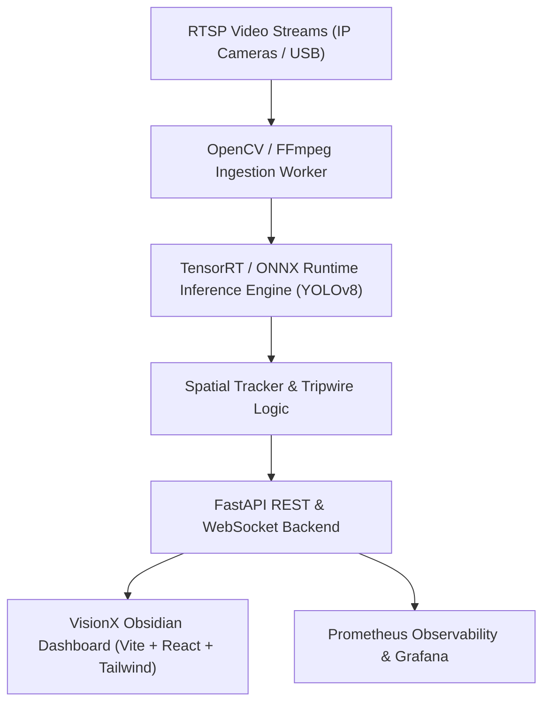

# VisionX System Architecture & Topology

VisionX is an end-to-end computer vision platform designed for real-time video stream ingestion, edge AI object detection, threat classification, and natural language video analytics.

## Core Subsystems

### 1. Ingestion Engine
Decodes multi-camera RTSP feeds at 1080p60 resolution using FFmpeg hardware acceleration (`h264_nvenc` / `h264_v4l2m2m`).

### 2. Edge Inference Layer
Executes YOLOv8 Nano/Medium object detection models compiled with NVIDIA TensorRT (INT8 Post-Training Quantization with entropy calibration), achieving sub-5ms P95 latency and up to 243.9 FPS.

### 3. Spatial Tracker & Tripwire Rules
Maintains ByteTrack target trajectories, velocity vectors, perimeter tripwire crossings, and spatial density heatmaps.

### 4. Natural Language Video Intelligence
Parses operator queries into structured database AST filters, grounding events against historical detection records with model confidence ratings.
